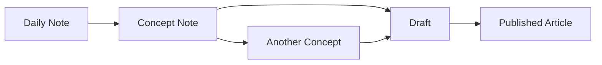
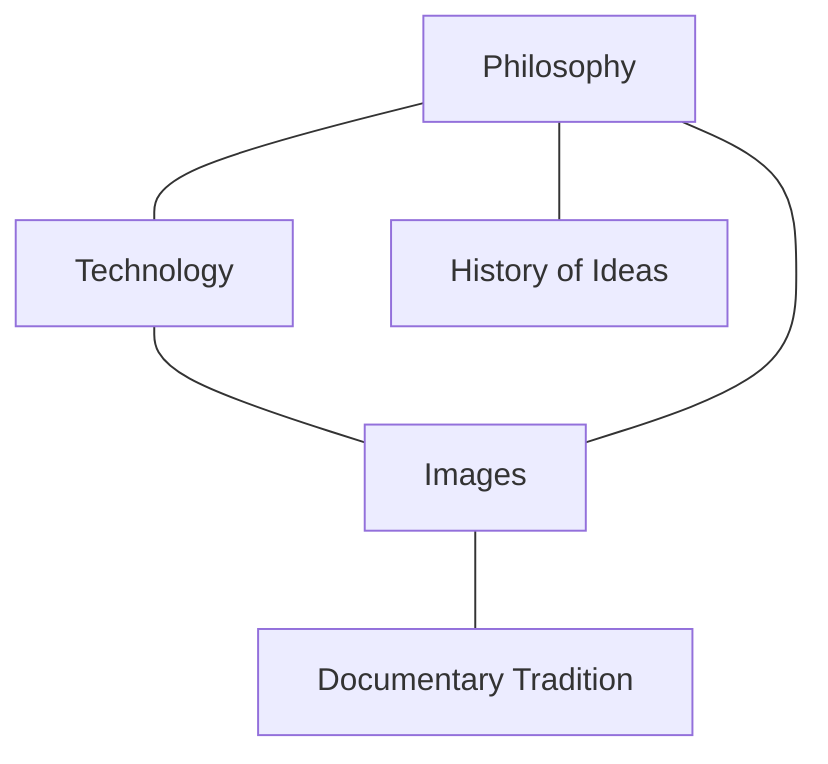

This note demonstrates what works (and what doesn't) when Obsidian content gets built into a Quartz site. It was written in this session with claude code: `claude --resume cb955edc-f6b6-4280-94b6-a48c89d7d4e3`

## Wikilinks

Standard `[[wikilinks]]` work out of the box. Quartz converts them to regular HTML links and resolves them using shortest-path matching.

- Link to the home page: [[Features|this is an aliased link to self]]
- Link to a note that doesn't exist: [[Nonexistent Note]]

Broken wikilinks render as dimmed, unclickable text rather than 404s.

## Callouts

Obsidian's `> [!type]` callout syntax is fully supported — all 13 types render with appropriate colours and icons.

> [!note] This is a note
> General-purpose callout for supplementary information.

> [!tip] Handy tip
> Also works with `[!hint]` and `[!important]`.

> [!warning] Careful
> Something to watch out for.

> [!quote] Walter Benjamin
> "The camera introduces us to unconscious optics as does psychoanalysis to unconscious impulses."

> [!example]- Collapsible callout (click to expand)
> Adding `-` after the type makes it collapsed by default.
> Adding `+` makes it expanded by default (but still collapsible).

> [!info] Nested callouts
> Callouts can be nested inside each other:
>> [!tip] Like this
>> Multiple levels of nesting work.

## Tags

Tags in YAML frontmatter render as clickable links. Quartz generates dedicated tag pages where you can browse all notes sharing a tag.

Check the top of this note — the `meta` tag is clickable and leads to a tag index.

Inline `#tags` in body text are also parsed and linked.

## Embeds

### Images

Standard Obsidian image syntax works. Both forms are supported:

```markdown
![[image.png]]

```

The `Assets` emitter plugin handles copying images to the build output.

### Note embeds

Embedding another note's content with `![[Note Name]]` is supported. Quartz renders the embedded note inline with a link back to the original.

### YouTube

YouTube embeds work with standard Obsidian iframe or markdown image syntax:


## LaTeX

Quartz uses KaTeX for rendering mathematical notation. Both inline and display modes work.

Inline: The equation $E = mc^2$ renders within the text.

Display mode:

$$
\int_{-\infty}^{\infty} e^{-x^2} dx = \sqrt{\pi}
$$

$$
\nabla \times \mathbf{E} = -\frac{\partial \mathbf{B}}{\partial t}
$$

## Mermaid Diagrams

Fenced code blocks with `mermaid` as the language render as interactive diagrams with pan/zoom controls.





## Code Blocks

Syntax highlighting is built in (using `github-light` and `github-dark` themes to match the site mode).

```python
def garden_note(thought: str) -> str:
    """Transform a passing thought into a cultivated note."""
    return f"## {thought.title()}\n\nTo be developed..."
```

```typescript
const config: QuartzConfig = {
  configuration: {
    pageTitle: "Sub-Surface Territories",
    enablePopovers: true,
  },
}
```

## Tables

GitHub Flavored Markdown tables render normally.

| Feature | Works in Quartz? | Notes |
|---------|:-:|-------|
| Wikilinks | Yes | Shortest-path resolution |
| Callouts | Yes | All 13 types + collapsible |
| LaTeX | Yes | KaTeX engine |
| Mermaid | Yes | Interactive pan/zoom |
| Dataview | No | Renders as raw code |
| Templater | N/A | Authoring-time only |
| Canvas | No | `.canvas` files ignored |

## Footnotes

Quartz renders footnotes as hover-able popovers[^1] as well as a footnote section at the bottom of the page[^2].

[^1]: This footnote appears as a popover when you hover over the superscript number, thanks to `enablePopovers: true` in the config.
[^2]: Footnotes also collect at the bottom of the page in the traditional way.

## Strikethrough and Highlights

- ~~Struck-through text~~ uses `~~double tildes~~`
- ==Highlighted text== uses `==double equals==`

## Task Lists

- [x] Set up Quartz
- [x] Configure plugins
- [ ] Write more notes
- [ ] Achieve enlightenment

## Comments

Obsidian comments using `%%` are stripped from the output — they're invisible on the published site.

Here is visible text. %%This comment won't appear on the site.%% And this is visible again.

## Arrows

The ObsidianFlavoredMarkdown plugin converts ASCII arrows to proper Unicode:

- `->` becomes ->
- `<-` becomes <-
- `<->` becomes <->

---

## What Doesn't Work

### Dataview

Quartz can't execute Dataview queries. They render as raw code blocks:

```dataview
LIST FROM #philosophy
```

If you rely on Dataview for dynamic content in Obsidian, those sections will need static alternatives for published notes.

### Templater Syntax

Templater's angle-bracket-percent syntax would cause build errors if encountered — but this isn't a practical issue since Templater runs at *authoring time* in Obsidian. (Case in point: Templater already processed the syntax in this very note before it could be saved as literal text.) The `Misc/` folder where templates live is excluded from the build via `ignorePatterns`.

### Canvas Files

Obsidian `.canvas` files aren't rendered by Quartz.

### Obsidian Plugins (Style Settings, Calendar, etc.)

Plugins like Style Settings, Calendar, and Advanced URI are *Obsidian-only* — they enhance the editing experience but have no effect on the published site. The Quartz site has its own theme, graph view, search, and explorer.
