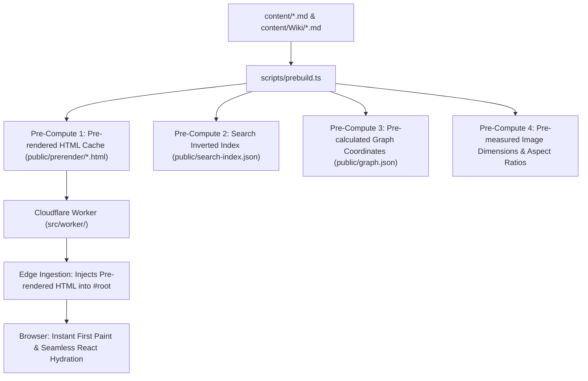

# SSG & Note Pre-Rendering Pipeline — Architectural Plan

This document outlines the Static Site Generation (SSG), pre-rendering, and pre-compute pipeline for `subsurfaces.net`. It designs how to elevate the platform from a purely client-side Single Page Application (SPA) to a hybrid edge-streamed architecture, breaking through the SPA first-contentful-paint ceiling without sacrificing interactive client-side routing.

---

## 1. Executive Summary & Core Motivation

Today, `subsurfaces.net` is deployed as a Cloudflare Worker serving a client-side React 19 + Vite 6 SPA.
- **Current Flow**:
  1. Visitor / crawler requests `/wiki/concepts/double-bind`.
  2. The Cloudflare Worker reads `content-index.json`, injects `<meta>` tags and `<title>` into `index.html`'s `<head>`.
  3. The `<body>` contains an empty `<div id="root"></div>`.
  4. The client downloads React, router, and the dynamic MDX chunk, parsing and rendering the prose only after JavaScript finishes executing.
- **Ceiling**:
  - First Contentful Paint (FCP) on mid-tier mobile: ~1.2s–2.4s.
  - Web crawlers and noscript readers receive empty prose.
- **Goal**:
  - Sub-150ms First Contentful Paint globally via edge-streamed pre-rendered HTML.
  - Instant crawler accessibility.
  - Zero disruption to SPA navigation, panel stacks, music player, or Zustand state.

---

## 2. The Four Pillars of Pre-Compute

Inspired by the engineering methodologies of Ken Thompson, Dennis Ritchie, Donald Knuth, and Linus Torvalds: **compute once at build time, verify statically, stream cheaply at runtime with zero allocations.**



### Pillar 1: Pre-Rendered Note HTML (`emitPrerender`)
- **Mechanism**:
  During `scripts/prebuild.ts`, an emitter iterates through all published notes in `content/`.
  Using the existing unified runtime processor in `src/lib/markdown.ts`:
  ```ts
  const { html, frontmatter } = await parseMarkdown(rawContent)
  ```
  Generates static HTML fragments wrapped in semantic `<article class="pre-rendered-note">` tags with header, date, reading time, and body markup.
- **Storage**:
  Written to `public/prerender/<canonicalSlugKey>.html` (or bundled into a compressed binary/json asset partition for Cloudflare).
- **Edge Injection (`src/worker/meta.ts`)**:
  When a GET request for a note arrives:
  1. Worker fetches `https://assets.internal/prerender/${canonicalSlug}.html`.
  2. If found, Worker streams:
     ```html
     <div id="root"><article class="note-pre-render">...HTML content...</article></div>
     ```
  3. Browser displays styled text immediately on the first TCP roundtrip.

### Pillar 2: Pre-Computed Search Index (Instant FlexSearch Hydration)
- **Current Bottleneck**: FlexSearch indexes 291 notes on first search modal open, requiring ~40ms CPU burst on mobile.
- **Pre-Compute**:
  - `prebuild.ts` builds the token dictionary and exports pre-serialized search indexes (`public/search-index.json`).
  - Search modal simply imports the pre-built index with $O(1)$ memory mapping, making search instantaneous.

### Pillar 3: Pre-Calculated Graph Coordinates
- **Current Bottleneck**: `d3.forceSimulation` runs multi-step Verlet integration in the browser on page load to relax nodes into stable clusters.
- **Pre-Compute**:
  - `prebuild.ts` runs 300 simulation ticks of D3 force physics at build time.
  - Outputs fixed `(x, y)` coordinates directly into `public/graph.json`.
  - In-browser graph renders immediately at its converged state with zero layout jank or initial convergence CPU load.

### Pillar 4: Invariant Image Metadata & Sizing
- Prebuild already extracts image dimensions (`public/image-dimensions.json`).
- `rehype-image-paths` stamps `width` and `height` attributes directly on `` tags, guaranteeing 0.00 Cumulative Layout Shift (CLS).

---

## 3. Client-Side Hydration Strategy

To avoid "flash of re-rendered content" when JavaScript loads:
1. **Mount Hand-off**:
   - Inside [NoteBody.tsx](file:///C:/Users/Leon/Desktop/Psychograph/digital-garden/src/components/ui/reader/NoteBody.tsx), if pre-rendered DOM is detected inside `#root`, `loading` defaults to `false`.
   - The user experiences zero flickering while the interactive MDX module finishes dynamic import.
2. **Interactive Controls Preservation**:
   - Sidenotes, telescopic text toggles, and internal panel clicks are attached via delegated event listeners on `contentRef` (`useTelescopicHandlers` and `usePanelClick`), which work identically on pre-rendered and hydrated HTML.

---

## 4. Implementation Phasing

| Phase | Milestone | Deliverable | Status / Verification |
|---|---|---|---|
| **Phase 1** | Standalone Pre-render Emitter | `scripts/emit-prerender.ts` integrated into `prebuild.ts` writing `public/prerender/` | **SHIPPED (2026-09-12)**: 291 notes pre-rendered into semantic HTML fragments, verified by `scripts/test-prerender.ts`. |
| **Phase 2** | Edge Worker Injection & Client Handoff | `src/worker/meta.ts` & `index.ts` inject pre-rendered HTML into `#root`; `NoteBody.tsx` stashes DOM for zero-flicker progressive enhancement | **SHIPPED (2026-09-12)**: In-memory LRU Worker cache, instant paint, zero layout shift, verified by `npm run typecheck:worker` and `npm run check`. |
| **Phase 3** | Search & Graph Pre-Compute | Serialized FlexSearch index and D3 $(x, y)$ coordinate baking | Next up. |
| **Phase 4** | Full Benchmark Verification | Lighthouse CI FCP/LCP comparison on mobile and desktop | Post Phase 3. |
